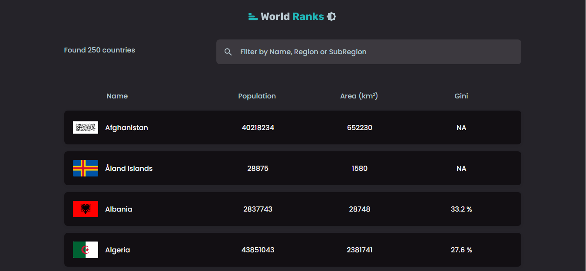

<p align="center">
   
</p>

# Portfolio

[](https://github.com/imkousik9)

My portfolio built with Next.js and ContentfulCMS

## Application Links

Frontend Code -> [https://github.com/imkousik9/world-ranks](https://github.com/imkousik9/world-ranks)
<br>
Deployed URL -> [https://world-ranks-one-kappa.vercel.app](https://world-ranks-one-kappa.vercel.app)
<br>

**Run the site locally**

### Step 1: Clone The Repo

Fork the repository. then clone the repo locally by doing -

```bash
git clone https://github.com/imkousik9/world-ranks.git
```

### Step 2: Install Dependencies

cd into the directory

```bash
cd world-ranks
```

install all the dependencies

```bash
yarn
# or
npm install
```

### Step 3: Start Development Server

Then start the development Server

```bash
yarn dev
# or
npm run dev
```

After running the development server the site should be running on https://localhost:3000

## Tech Stack

<b>Frontend</b>: Reactjs, Nextjs, Typescript
<br>
<b>Styling</b>: CSS
<br>
<b>API</b>: restcountries.com/v2
<br>
<b>Deployment</b>: Vercel
